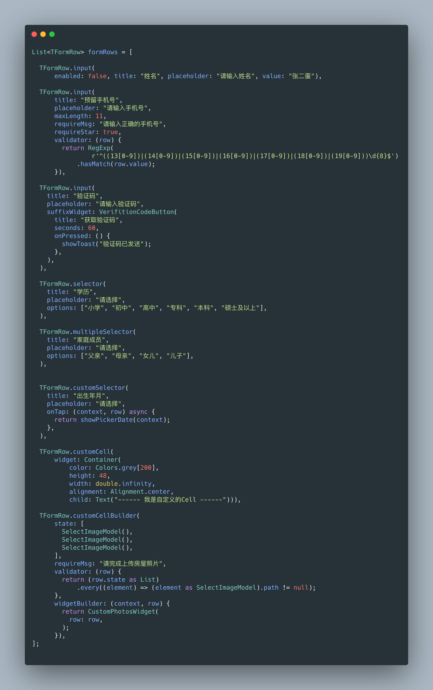
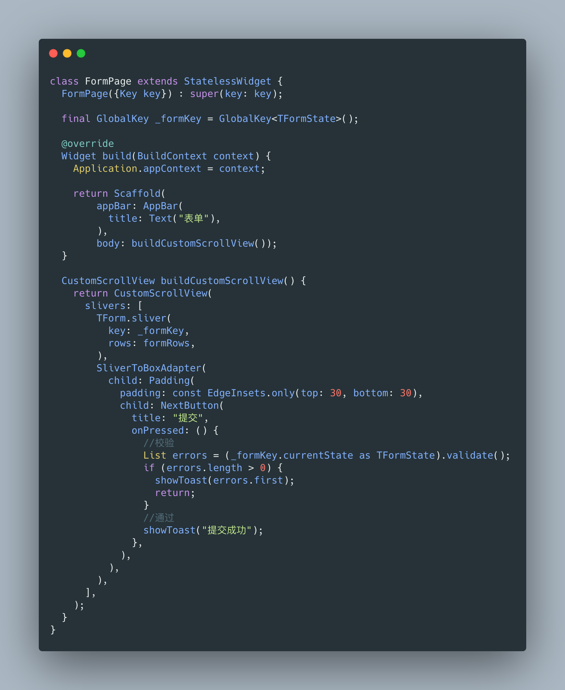

# tform

A easy, extensible and dynamic flutter form framework.

## Installing
Add this to your package's pubspec.yaml file:
```yaml
dependencies:
  tform: ^0.3.0
```

## Example


## Build Form Rows


## Build Form

