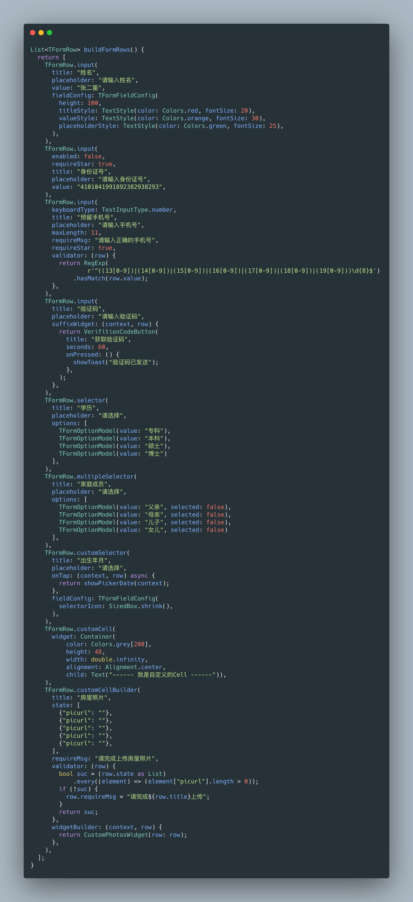
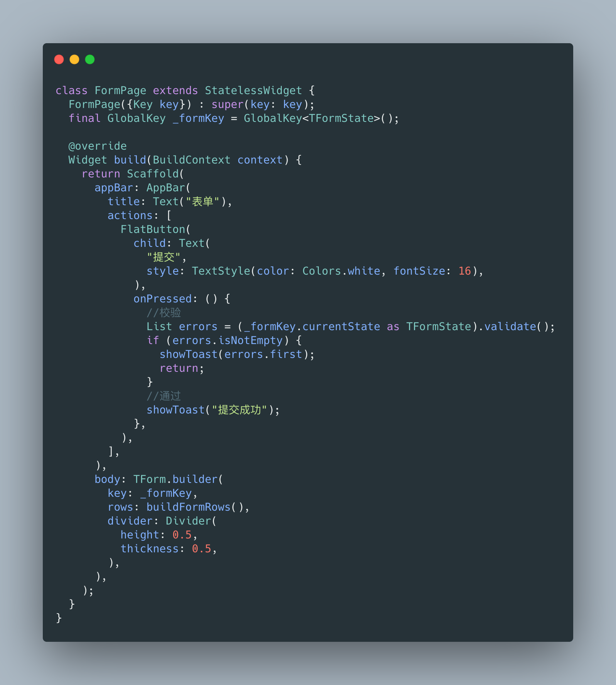

# tform

A easy, extensible and dynamic flutter form framework. Support for custom selectors, validators and widgets. Support form verification, insert, delete and so on.

## Installing
Add this to your package's pubspec.yaml file:

```yaml
dependencies:
  tform: ^1.0.1
```

## Example


## Build Form Rows


## Build Form

